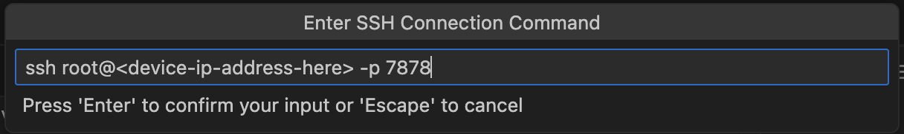

# vscode-remote-dev-balena

A barebones Ubuntu 22.04 container for writing temporary/experimental hardware interface code to test drivers & hardware that would otherwise be unavailable to test on a desktop machine.

## Dependancies
1. The [Remote Extension Pack](https://marketplace.visualstudio.com/items?itemName=ms-vscode-remote.vscode-remote-extensionpack) for vscode.
2. `rsync`:
    * **macos** - `brew install rsync`.
    * **linux** - `sudo apt-get install rsync`.

## Connecting to your Container with SSH
Make sure to specify the port as `7878` when you connect.

> Note: Make sure to also change the default password!!

<p align="center">
    
</p>

## Notes on the `docker-compose.yml`
Privileged-mode is enabled and network_mode is set to host to grant elevated privileges when interfacing with network devices & gpio perhipherals. Be sure to remove/disable these for production builds.
```yaml
privileged: true
network_mode: host
```

## Copying Edited Files back to Host
Rather than manually dragging/dropping files from your host machine to the device-under-test, it is recommended you use `rsync`:

```bash
rsync -rlptzv --progress --delete --exclude=.git "root@<device-ip-address-here>:~/app/" <dir-on-your-host-machine>
```

You may wish to `--exclude` additional folders such as `target/`, `node_modules` or `venv` which likely include binaries compiled to the device-under-tests CPU architecture, which are uncompatibile with your host machine.

I recommend running this command on your host machine after significant changes in source code.


